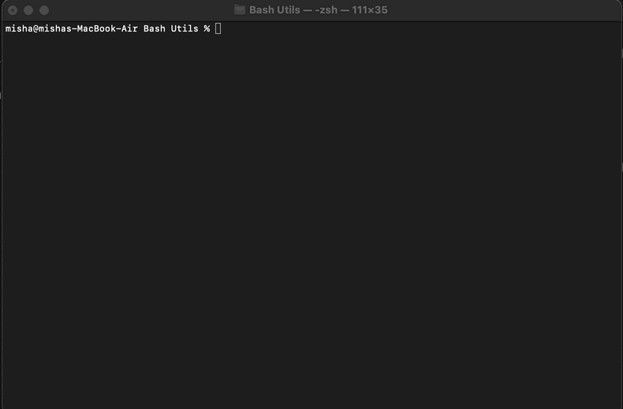

# Project Overview: Simple Bash Utils

This project was aimed at recreating two fundamental Bash utilities, `cat` and `grep`, both of which are integral to Linux terminal operations. 



## Installation:
````
git clone https://github.com/0xmisha/bash-utils.git
cd bash-utils/src/cat
make
bash test.sh
````

## Requirements:

- Gcc
- Make

## Realizations:

1. **Cat Utility:** 
   - All flags, including the GNU versions, as specified in the documentation, were implemented. This includes numbering non-empty lines, displaying end-of-line characters, squeezing multiple adjacent blank lines, and more.
   - The source, header, and build files for this utility were placed in the `src/cat/` directory, and the executable was named `s21_cat`.

2. **Grep Utility:** 
   - The basic implementation supported flags such as `-e`, `-i`, `-v`, `-c`, `-l`, and `-n`. For regular expression parsing, only the `pcre` or `regex` libraries were permitted.
   - An advanced bonus implementation added support for flags like `-h`, `-s`, `-f`, and `-o`.
   - A further enhancement allowed for the pairing of flag combinations, like `-iv` and `-in`.
   - All source, header, and build files were organized in the `src/grep/` directory, with the executable being `s21_grep`.

3. **Development Standards:** 
   - The codebase adheres to the C11 standard using the `gcc` compiler.
   - Strictly followed the Google coding style, ensuring clarity and maintainability.
   - Made extensive use of Makefile for building, with targets like `s21_cat` and `s21_grep`.
   - Adherence to the principles of structured programming was paramount, minimizing code duplications and maximizing module reusability. Shared modules were placed in the `src/common` directory.
   - Integration tests were crafted to ensure the utilities' behavior mirrored that of their genuine Bash counterparts.

Through this exercise, the foundational principles of structured programming were reinforced, and the inner workings of primary Bash utilities were deeply understood.